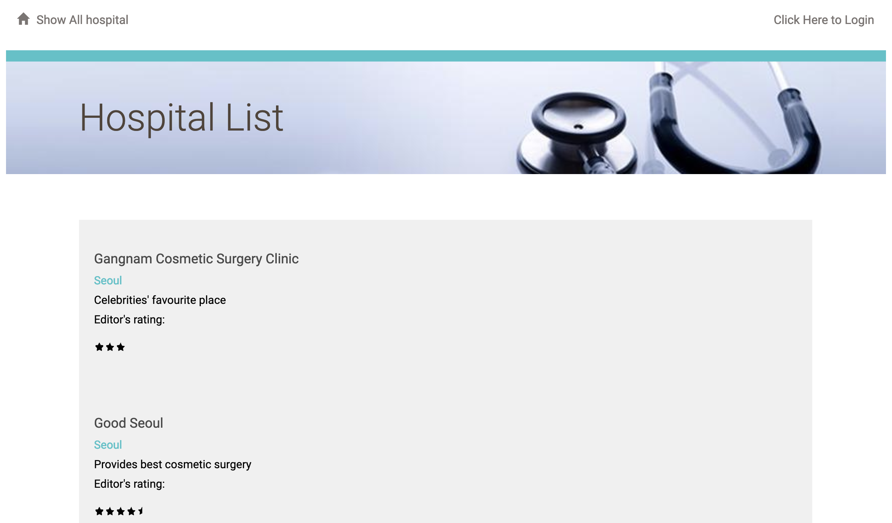
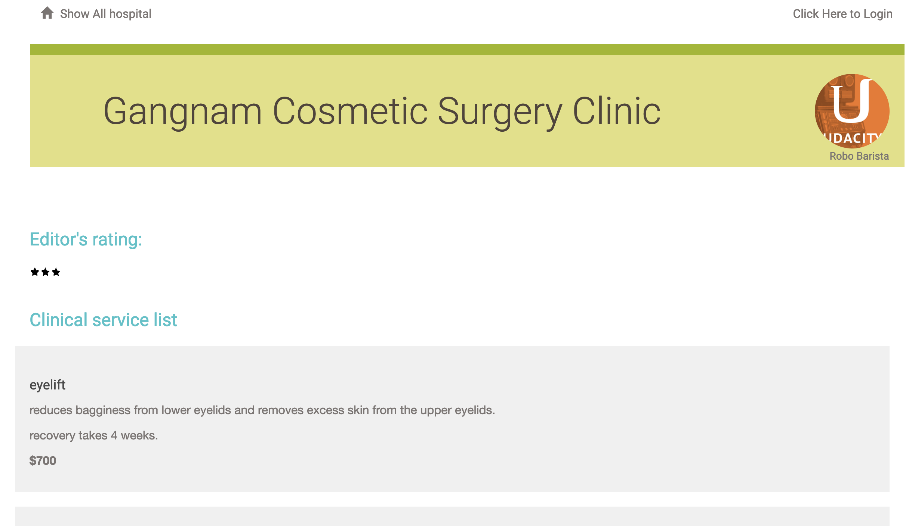
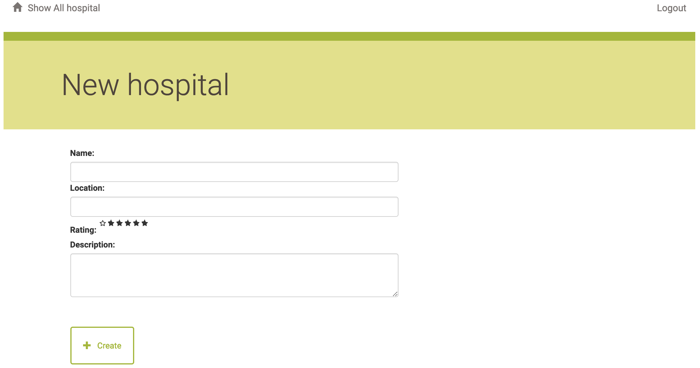
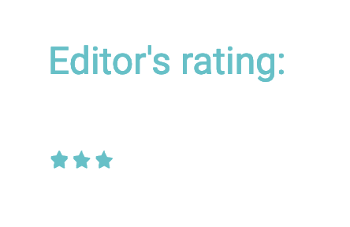

# Item Catalog
## From Udacity Full Stack Web Developer Nanodegree Program Project: Item Catalog
### Preface
This is an application that provides a list of items within a variety of categories as well as provide a user registration and authentication system. Registered users will have the ability to post, edit and delete their own items.

### How to run the program
VMbox, vagrant, python, flask, and sqlalchemy are required to run this application.
* VMbox: https://www.virtualbox.org/wiki/Download_Old_Builds_5_1
* Vagrant: https://www.vagrantup.com/downloads.html
* Python: https://www.python.org/downloads/
* Flask: http://flask.pocoo.org/
* Sqlachemy: https://www.sqlalchemy.org/

```
1) Install Vagrant and VirtualBox
2) Clone the fullstack-nanodegree-vm
3) Launch the Vagrant VM (vagrant up)
4) Write your Flask application locally in the vagrant/catalog directory (which will automatically be synced to /vagrant/catalog within the VM).
5) Run 'python database_setup.py' to create database
6) Run 'python service.py' to populate the database
7) Run 'python project.py' to start the application
8) Go to http://localhost:5000/ for the application
```

### What this application looks like
1. main page
Main page has a overview of hospitals with their name, location, description, and editor's rating.


2. service page
Service page shows a service list of the hospital. Each service has a name, description, recovery time, and cost.


3. creat or edit page
Creating or editing a hospital or service is available. 



### Explanation of the code
1. Data structure from ./database_setup.py
* User table has id, name, email, and picture columns. User.id is connected to the Hospital and Service tables.
```
class User(Base):
    __tablename__ = 'user'

    id = Column(Integer, primary_key=True)
    name = Column(String(250), nullable=False)
    email = Column(String(250), nullable=False)
    picture = Column(String(250))
```

* Hospital table has id, name, user_id, location, description, and rating columns. Note that this table is linked to the User table by relationship(User).
```
class Hospital(Base):
    __tablename__ = 'hospital'

    id = Column(Integer, primary_key=True)
    name = Column(String(250), nullable=False)
    user_id = Column(Integer, ForeignKey('user.id'))
    user = relationship(User)
    location = Column(String(250))
    description = Column(String(250))
    rating = Column(Float(100))
```

* Service table has id, name, description, price, recovery_weeks, hospital_id, user_id, and user columns. Note that this table is linked to the User and Hospital table by relationship(User) and relationship(Hospital) respectively.
```
class Service(Base):
    __tablename__ = 'service_item'

    name = Column(String(80), nullable=False)
    id = Column(Integer, primary_key=True)
    description = Column(String(250))
    price = Column(String(8))
    recovery_weeks = Column(Integer)
    hospital_id = Column(Integer, ForeignKey('hospital.id'))
    hospital = relationship(Hospital)
    user_id = Column(Integer, ForeignKey('user.id'))
    user = relationship(User)
```

2. Json query
* Hospital and Service tables handle json query by the following code.
(./database_setup.py)
```
class Hospital(Base):
~ ~ ~
@property
    def serialize(self):
        """Return object data in easily serializeable format"""
        return {
            'name': self.name,
            'id': self.id,
            'location': self.location,
            'description': self.description,
            'rating': self.rating,
        }

class Service(Base):
~ ~ ~

@property
    def serialize(self):
        """Return object data in easily serializeable format"""
        return {
            'name': self.name,
            'description': self.description,
            'id': self.id,
            'price': self.price,
            'recovery_weeks': self.recovery_weeks,
        }
```

3. Note
* 5-star rating feature to allow hospitals have a 5-star rating, I copied and modified the code from the following page.  
https://codepen.io/redlabor/pen/wyiAH  
Note that this 5-star rating feature provides half star rating as well.  


(./static/styles.css)
```
/* Base setup */
@import url(//netdna.bootstrapcdn.com/font-awesome/3.2.1/css/font-awesome.css);

/* Ratings widget */
.rate {
    display: inline-block;
    border: 0;
}
/* Hide radio */
.rate > input {
    display: none;
}
/* Order correctly by floating highest to the right */
.rate > label {
    float: right;
}
/* The star of the show */
.rate > label:before {
    display: inline-block;
    font-size: 1.1rem;
    padding: .3rem .2rem;
    margin: 0;
    cursor: pointer;
    font-family: FontAwesome;
    content: "\f005 "; /* full star */
}
/* Zero stars rating */
.rate > label:last-child:before {
    content: "\f006 "; /* empty star outline */
}
/* Half star trick */
.rate .half:before {
    content: "\f089 "; /* half star no outline */
    position: absolute;
    padding-right: 0;
}
```

* Oauth2.0 login feature
Currently, this application only provides third party login from Facebook. Google plus login button keeps disappearing and the problem solving is under way. However, log-in/-out with Facebook feature functions correctly.

* project.py passed pycodestyle with one error:
```
project.py:382:80: E501 line too long (81 > 79 characters)
```
(If you give a line break in 382 then it shows another error.)
